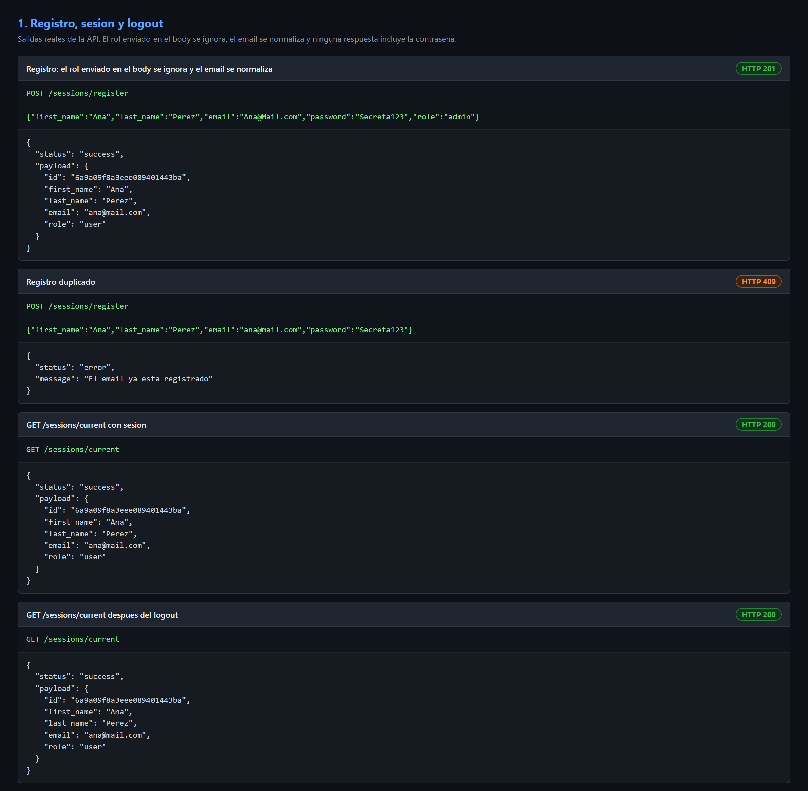
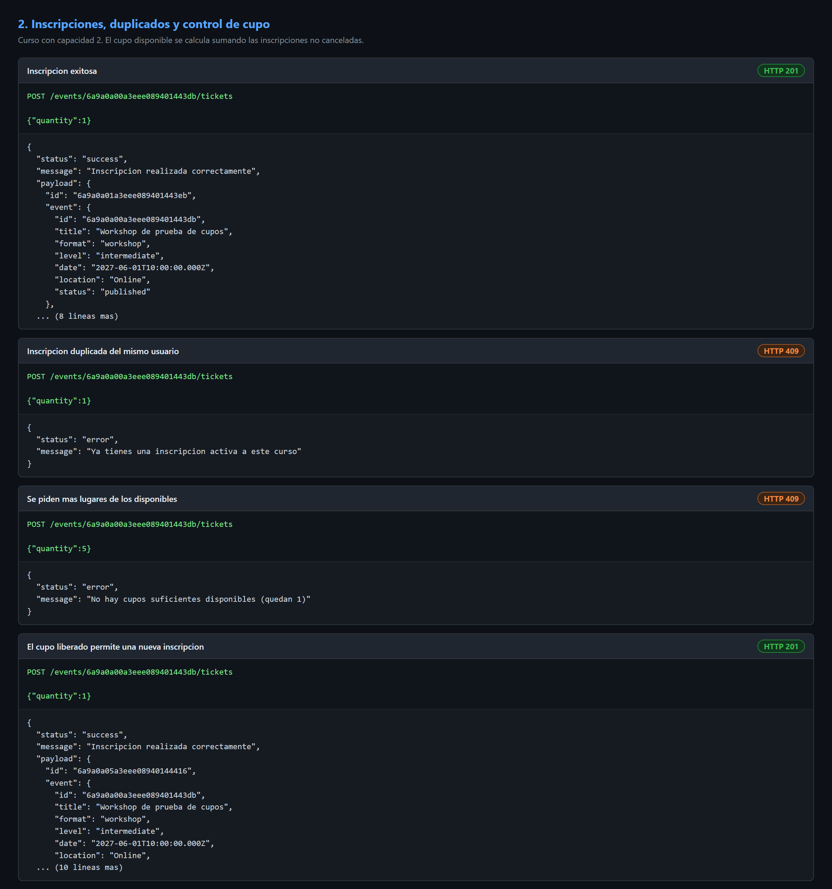
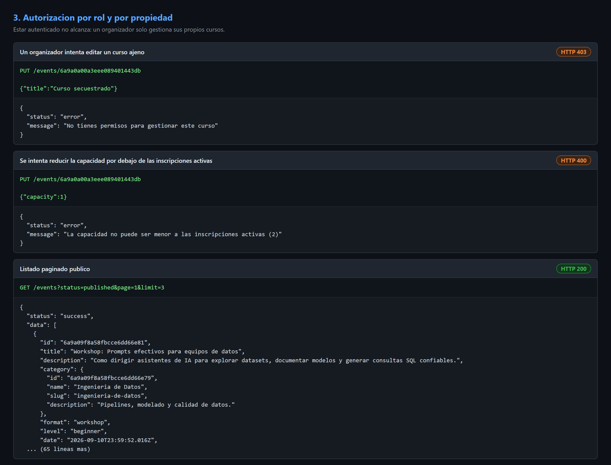
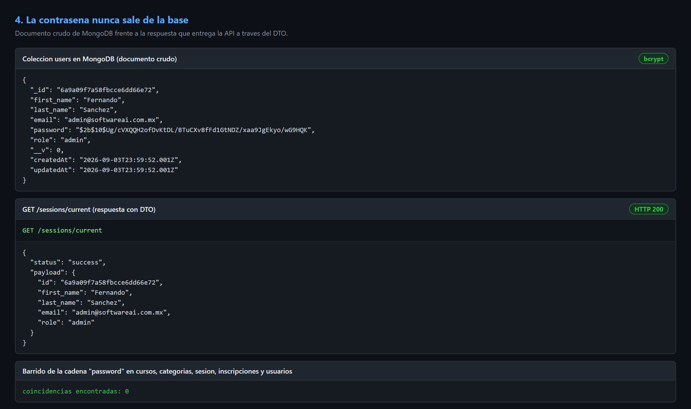
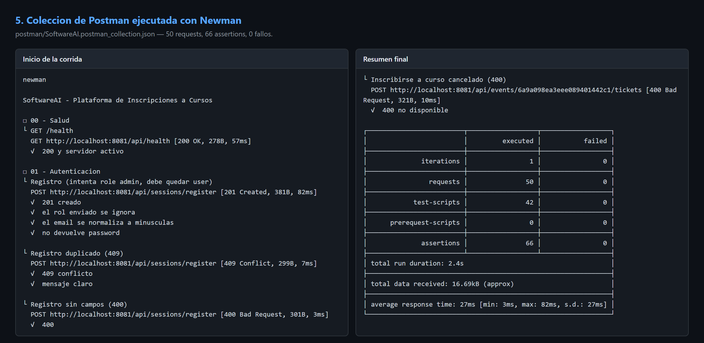

# Evidencia del entregable

## Que hay aca

| Archivo | Contenido |
|---------|-----------|
| [`EVIDENCIA.md`](EVIDENCIA.md) | transcripcion completa: request, codigo HTTP y respuesta de cada caso |
| [`newman-run.txt`](newman-run.txt) | salida de la coleccion de Postman ejecutada con Newman |
| [`capturas/`](capturas) | las mismas salidas en imagen, listas para adjuntar |

Todo se genera contra la API corriendo, no esta escrito a mano.

## Capturas

### 1. Registro, sesion y logout
El rol enviado en el body se ignora, el email se normaliza y ninguna respuesta incluye la contrasena.



### 2. Inscripciones, duplicados y control de cupo
Curso con capacidad 2: inscripcion, duplicado rechazado, cupo insuficiente y lugar liberado tras cancelar.



### 3. Autorizacion por rol y por propiedad
Un organizador no toca cursos ajenos, y la capacidad no baja de las inscripciones activas.



### 4. La contrasena nunca sale de la base
Documento crudo de MongoDB con el hash de bcrypt, frente a la respuesta que entrega el DTO.



### 5. Coleccion de Postman ejecutada con Newman
50 requests, 66 assertions, 0 fallos.



## Como regenerar todo

```bash
npm start
```

```bash
npm run evidencia
```

`npm run evidencia` recarga la base, ejecuta el flujo completo y reescribe `EVIDENCIA.md`.
Para rehacer tambien las imagenes:

```bash
npm run capturas
```

Ese comando arma los HTML de `capturas/`, los fotografia con Chrome en modo headless y recorta el
sobrante. Requiere Chrome o Edge instalados y `pip install pillow`.
